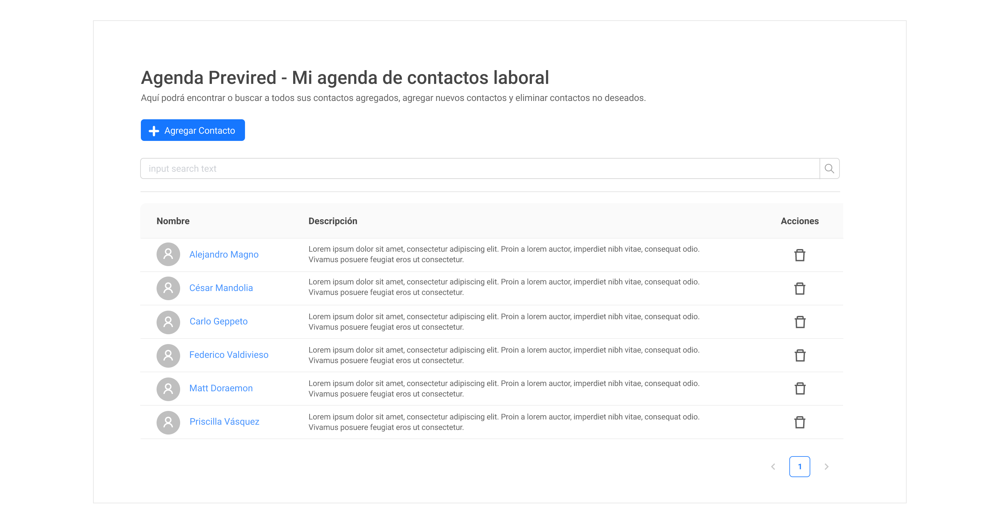
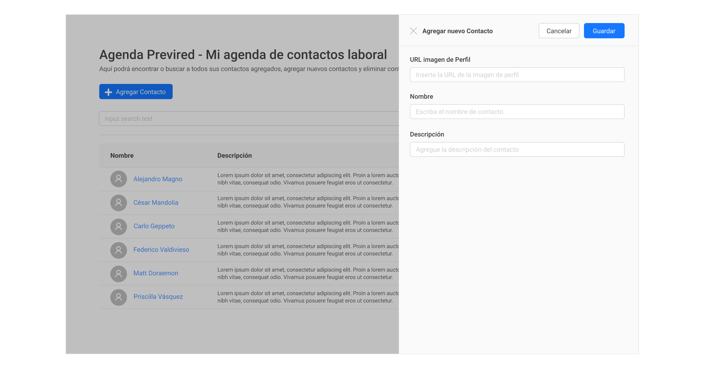

## Previred Frontend Test - Agenda de contactos

### Introducción

La siguiente prueba busca evaluar los conocimientos que hayas desarrollado en javascript/typescript, css y html, y su aplicación en un proyecto React.

### Descripción e instalación

Se adjunta un proyecto de nodejs, con una pequeña base de datos y una api ya desarrollada. Para ejecutar el proyecto, una vez descargado hay que correr las siguientes líneas por línea de comandos en el root del proyecto:

```
npm install
node server.js
```

Los requisitos son únicamente tener instalado una versión de `node >= 4` y `npm`.
Si todo funcionó correctamente, va a correr el servidor, y vas a poder acceder a través de cualquier navegador en la dirección: [localhost:9000](http://localhost:9000).

### Desarrollo

El objectivo del test es crear una aplicación React desde cero y desarrollar 2 vistas utilizando la api incluida en el proyecto.

La primera vista consiste en una lista paginada de usuarios con un buscador. Se debe visualizar la imagen del usuario con su respectivo nombre, y la descripción al lado, como se ve a continuación:



La segunda vista consiste en el formulario para agregar un usuario. Se gatilla un drawer al presionar el botón de `Agregar Contacto` de la vista anterior. La única validación que debe hacer este formulario, es que verifique que se incluyen todos los campos. Una vez completado, al presionar el botón `Guardar` debe enviar la información por AJAX a la api para crear el usuario. La vista se muestra a continuación:



### Descripción de la API

El proyecto incluye la api y la base de datos de almacenamiento. La api es REST, y a continuación se especifican sus métodos:

| Método HTTP | Ruta           | Descripción                                                                                                                                                                                                            |
| ----------- | :------------- | ---------------------------------------------------------------------------------------------------------------------------------------------------------------------------------------------------------------------- |
| GET         | /api/users     | Devuelve la lista de todos los usuarios. Para paginar necesita recibir adicionalmente los parámetros `_page` y `_limit` : `/api/users?_page=2&_limit=10`. Para buscar, necesita el parámetro `q`: `/api/users?q=texto` |
| GET         | /api/users/:id | Devuelve únicamente el usuario especificado por el id                                                                                                                                                                  |
| POST        | /api/users     | Crea un usuario nuevo. Debe incluir el header `Content-Type: application/json`, y los parámetros en formato JSON. Ej: `{"name": "Algún nombre","description": "Alguna descripción","photo": "Alguna URL"}`             |
| DELETE      | /api/users/:id | Elimina el usuario correspondiente al id dado.                                                                                                                                                                         |

### Criterios de evaluación

Se pide específicamente el uso de [React](https://facebook.github.io/react/). versión 17+. Dará un valor adicional, aunque no es obligatorio, el uso además de API-Context para la administración de estados en la aplicación. Adicionalmente se evaluarán los siguientes puntos:

1. Utilización de patrones, buenas prácticas en el código y arquitectura acorde
2. Documentación en el código
3. Diseño lo más similar posible a las imágenes mostradas más arriba
4. Tiempo en realizar la tarea
5. Uso de custom Hooks
6. Uso de Ant Design como librería de estilos
7. Control de excepciones en las llamadas a los servicios (mensaje acorde al error)

### Plazos y envío

Esta prueba considera un plazo máximo que podrás encontrar en el correo de contacto, y es además un criterio de evaluación, por lo que se espera una buen balance entre calidad y el tiempo usado. Una vez terminada la tarea, debes enviar un pull request al repositorio con tu nombre completo, correo y cargo al que postulas, además de notificar por correo que has finalizado la prueba. Cabe destacar, que todos los PRs serán rechazados una vez que se revisen, lo que no significa que tu proceso haya sido descartado, es sólo parte del procedimiento una vez que tu solución es revisada.

----

----

----

# Prueba para el cargo Ingeniero de Desarrollo FrontEnd, Alejandro Silva

### Stack y dependencias

Para el desarrollo se utilizo [Vite v5.1](https://vitejs.dev/), esto para tener rapidamente un ambiente de desarrollo 
con HMR, por su proceso de bundling en el que se entregan los archivos listos para producción.

Las vistas usan [React v18.2](https://es.react.dev/), y la libreria de componentes UI ContextProvider [Ant Design v5.14](https://ant.design/docs/react/introduce).

No fueron necesarias otras librerias ni herramientas para solucionar el desafio tecnico.

### Build para producción

Con el comando `npm run start-prod` se ejecuta el bundler que corre typescript y `vite build`. Este genera artifacts listos para
ser usados en producción (en la carpeta `/dist`)

Acontinuación se ejecuta el proceso de express con `json-server`, sirviendo las paginas generadas.

Se puede ver el resultado visitando [http://localhost:9000](http://localhost:9000).

| Tabla con usuarios | Formulario nuevo usuario |
| -- | -- |
|  |    |


### Desarrollo en local

Con el comando `npm run start-dev` se ejecuta un servidor con `json-server` en el puerto 9000 con el API 
([http://localhost:9000](http://localhost:9000)), y en paralelo Vite en modo desarrollo (con HMR) en [http://localhost:5173](http://localhost:5173)


### Indicaciones para ejecutar el proyecto

1) Instalar las dependencias
```bash
npm install
```

2) Generar los archivos de producción y levantar el servidor
```bash
npm run start-prod
```

3) Visitar la pagina: [http://localhost:9000](http://localhost:9000)

### Contacto

A través de [Linkedin](https://www.linkedin.com/in/asilva-dev/), o por el correo [pm5k.sk@gmail.com](pm5k.sk@gmail.com).
